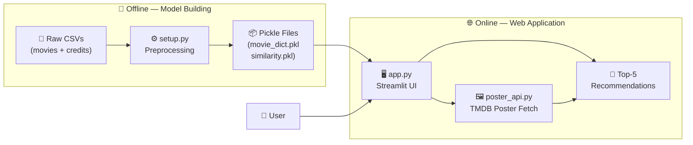
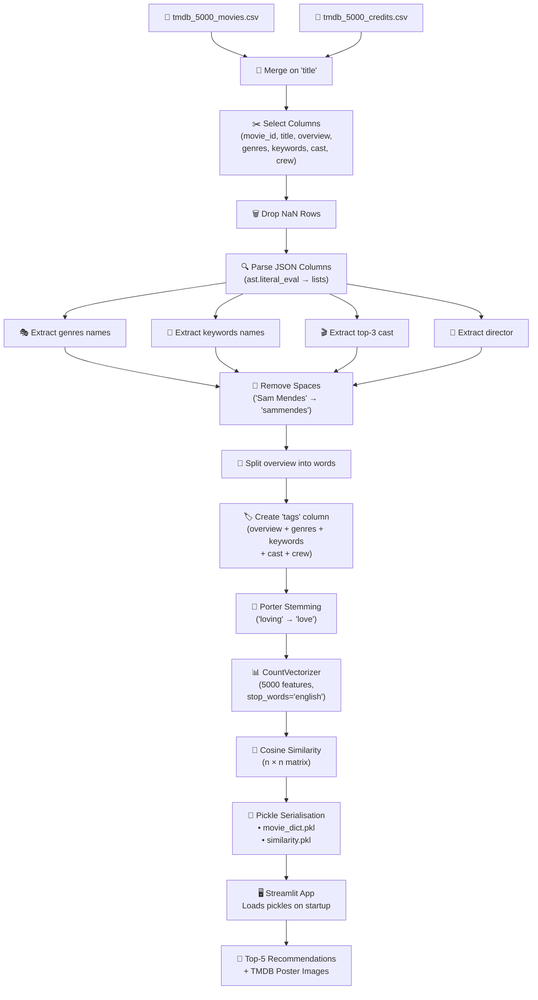
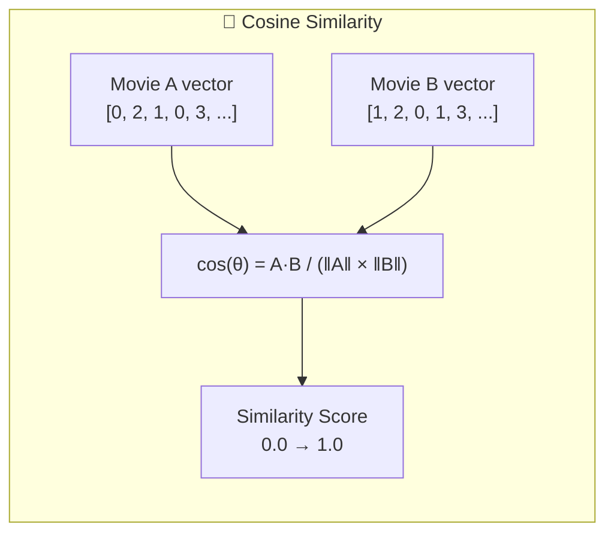
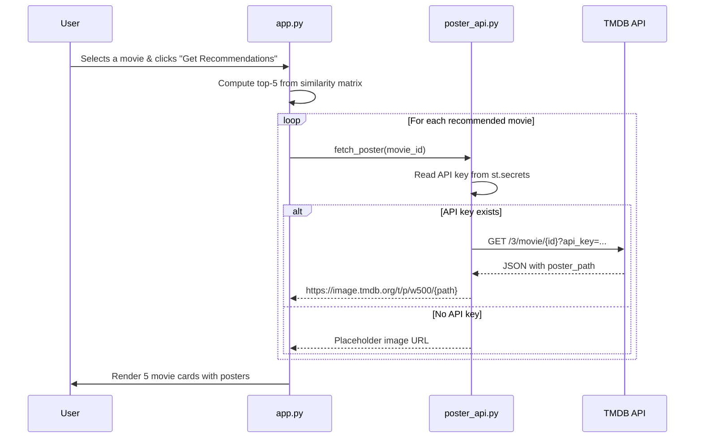

# 🏗️ Architecture — Movie Recommendation System

> A content-based movie recommendation engine powered by **Cosine Similarity**
> and the **TMDB 5000 Movies** dataset.

---

## 📑 Table of Contents

| # | Section |
|---|---------|
| 1 | [System Overview](#-1-system-overview) |
| 2 | [Data Flow Pipeline](#-2-data-flow-pipeline) |
| 3 | [Component Descriptions](#-3-component-descriptions) |
| 4 | [ML Pipeline — Step by Step](#-4-ml-pipeline--step-by-step) |
| 5 | [Technology Choices & Rationale](#-5-technology-choices--rationale) |
| 6 | [Data Schema](#-6-data-schema) |
| 7 | [API Integration (TMDB)](#-7-api-integration-tmdb) |
| 8 | [Directory Structure](#-8-directory-structure) |

---

## 🔭 1. System Overview

The system is split into **two phases**: an offline **model-building** phase and
an online **serving** phase. During the build phase, raw CSV data is cleaned,
transformed into numerical vectors, and a cosine-similarity matrix is
pre-computed. During the serving phase, the Streamlit app loads the serialised
artefacts and returns the top-5 most similar movies in real time.



### High-Level Request Flow

1. **User** selects a movie from the dropdown.
2. **app.py** looks up the movie's index in the similarity matrix.
3. The row is sorted in descending order; the top-5 indices (excluding itself) are picked.
4. For each recommended movie, **poster_api.py** fetches the poster from the TMDB API.
5. Titles + posters are rendered as stylised cards in the browser.

---

## 🔄 2. Data Flow Pipeline

The diagram below traces every transformation from raw CSV to final UI output.



### Pipeline Summary Table

| Step | Input | Transformation | Output |
|------|-------|----------------|--------|
| 1 | 2 CSV files | `pd.merge(on='title')` | Single merged DataFrame |
| 2 | 7 columns | `ast.literal_eval` | Parsed list columns |
| 3 | Multi-word names | `.replace(' ', '').lower()` | Single-token names |
| 4 | 5 list columns | List concatenation | Combined `tags` column |
| 5 | Raw tags | `PorterStemmer().stem()` | Stemmed tags |
| 6 | Stemmed text | `CountVectorizer(5000)` | Sparse matrix `(n, 5000)` |
| 7 | Feature vectors | `cosine_similarity()` | Dense matrix `(n, n)` |
| 8 | Matrix + DataFrame | `pickle.dump()` | `.pkl` files on disk |

---

## 📦 3. Component Descriptions

### 3.1 `setup.py` — Data Preprocessing & Model Builder

| Attribute | Detail |
|-----------|--------|
| **Role** | Offline pipeline — runs once to produce model artefacts |
| **Entry point** | `python setup.py` |
| **Key functions** | `load_data()`, `preprocess_features()`, `apply_stemming()`, `build_similarity_matrix()`, `save_model()` |
| **Outputs** | `models/movie_dict.pkl`, `models/similarity.pkl` |

The script orchestrates the full ETL + ML pipeline:

1. **Load** — Reads both CSVs, merges on `title`, selects 7 columns, drops nulls.
2. **Feature extraction** — Parses JSON columns (`genres`, `keywords`, `cast`, `crew`) via `ast.literal_eval`.
3. **Text normalisation** — Lowercases, removes spaces from names, applies Porter Stemming.
4. **Vectorisation** — Builds a Bag-of-Words matrix with `CountVectorizer(max_features=5000, stop_words='english')`.
5. **Similarity** — Computes pairwise cosine similarity across all movie vectors.
6. **Serialisation** — Pickles the processed DataFrame (as dict) and the similarity matrix.

### 3.2 `app.py` — Streamlit Web Application

| Attribute | Detail |
|-----------|--------|
| **Role** | Online serving — interactive UI for movie recommendations |
| **Entry point** | `streamlit run app.py` |
| **Key functions** | `load_model()`, `build_model()`, `recommend()`, `main()` |
| **Dependencies** | `poster_api.py`, pickle files from `setup.py` |

Core responsibilities:

- **Auto-build**: If pickle files are missing but raw CSVs exist, `setup.py` is invoked automatically via `subprocess`.
- **Caching**: `@st.cache_data` decorators ensure model files are loaded only once per session.
- **Recommendation logic**: Looks up the selected movie's row in the similarity matrix, sorts descending, and returns the top 5.
- **UI rendering**: Premium-styled movie cards with poster images, gradient branding, tech badges, and a "How It Works" expander.

### 3.3 `poster_api.py` — TMDB Poster Fetching Module

| Attribute | Detail |
|-----------|--------|
| **Role** | External API integration — fetches poster images |
| **Entry point** | `from poster_api import fetch_poster` |
| **Key function** | `fetch_poster(movie_id)` |
| **API endpoint** | `https://api.themoviedb.org/3/movie/{id}` |

Design decisions:

- **Graceful degradation** — Returns a placeholder image if the API key is missing or the request fails.
- **Secret management** — API key is read from `st.secrets["TMDB_API_KEY"]` (stored in `.streamlit/secrets.toml`).
- **Timeout** — HTTP requests use a 5-second timeout to prevent the UI from hanging.

### 3.4 `notebooks/movie_recommender.py` — Data Exploration Script

| Attribute | Detail |
|-----------|--------|
| **Role** | Interactive exploration & prototyping (Jupyter-compatible) |
| **Sections** | EDA → Preprocessing → Vectorisation → Similarity → Testing |
| **Usage** | Open in VS Code with Jupyter extension, or convert via `jupytext` |

This script mirrors the `setup.py` pipeline but adds exploratory analysis
(missing-value checks, duplicate counts, sample outputs at each step). It uses
`# %%` cell markers so it can run as a notebook inside VS Code.

---

## 🧠 4. ML Pipeline — Step by Step

### Step 1 — Data Loading & Merging

```python
movies = pd.read_csv("data/tmdb_5000_movies.csv")
credits = pd.read_csv("data/tmdb_5000_credits.csv")
movies = movies.merge(credits, on="title")
```

Two separate CSVs are joined on the `title` column. After merging, only 7
columns are retained: `movie_id`, `title`, `overview`, `genres`, `keywords`,
`cast`, `crew`.

### Step 2 — JSON Parsing

The `genres`, `keywords`, `cast`, and `crew` columns store data as JSON strings:

```
'[{"id": 28, "name": "Action"}, {"id": 12, "name": "Adventure"}]'
```

`ast.literal_eval` safely parses these into Python lists, then only the `name`
field is extracted. For **cast**, only the **top 3** actors are kept. For
**crew**, only the **director** is extracted.

### Step 3 — Space Removal & Lowercasing

```python
"Sam Mendes" → "sammendes"
"Science Fiction" → "sciencefiction"
```

**Why?** Without this step, "Sam" in "Sam Mendes" could match "Sam" in "Sam
Worthington", producing a false similarity signal. Concatenating the words into
a single token ensures each person/genre is treated as one unique feature.

### Step 4 — Tags Column Creation

All extracted features are concatenated into a single `tags` string per movie:

```
tags = overview_words + genres + keywords + cast + crew
```

This flattened representation lets us treat each movie as a text document.

### Step 5 — Porter Stemming

```python
"loving" → "love"    "action" → "action"
"dancing" → "danc"   "runner" → "runner"
```

Stemming collapses inflected forms into a common root so that "loved",
"loving", and "love" all map to the same feature dimension.

### Step 6 — CountVectorizer (Bag of Words)

```python
cv = CountVectorizer(max_features=5000, stop_words="english")
vectors = cv.fit_transform(df["tags"]).toarray()
# vectors.shape → (4806, 5000)
```

Each movie becomes a 5000-dimensional vector where each dimension counts how
many times a particular word appears in that movie's tags.

### Step 7 — Cosine Similarity

```python
similarity = cosine_similarity(vectors)
# similarity.shape → (4806, 4806)
```

Cosine similarity measures the **angle** between two vectors:

- **1.0** → identical direction (very similar movies)
- **0.0** → perpendicular (no similarity)



### Step 8 — Recommendation

```python
distances = similarity[movie_index]
top_5 = sorted(enumerate(distances), key=lambda x: x[1], reverse=True)[1:6]
```

Given a selected movie, its row in the similarity matrix is retrieved, sorted in
descending order, and the top 5 (excluding itself at index 0) are returned.

---

## ⚖️ 5. Technology Choices & Rationale

### Why **Content-Based** Filtering?

| Factor | Content-Based | Collaborative Filtering |
|--------|:---:|:---:|
| Needs user interaction history | ❌ No | ✅ Yes |
| Cold-start problem | ✅ Handled | ❌ Fails for new users |
| Dataset required | Movie metadata only | User-item ratings |
| Complexity | Low | Medium-High |

> **Decision:** The TMDB dataset provides rich metadata but **no user ratings
> matrix**, making content-based filtering the natural choice. It also avoids
> the cold-start problem entirely.

### Why **CountVectorizer** over TF-IDF?

| Aspect | CountVectorizer (Chosen) | TF-IDF |
|--------|:---:|:---:|
| What it captures | Raw word frequency | Frequency weighted by rarity |
| Behaviour with common words | Relies on `stop_words` removal | Down-weights common words automatically |
| Best for | Short, uniform-length documents | Long, variable-length documents |

> **Decision:** Our `tags` column is a short, uniform concatenation of
> keywords, names, and a brief overview. After stop-word removal, the remaining
> words are all meaningful features (genre names, actor names). TF-IDF's
> inverse-document-frequency weighting would actually **down-weight** popular
> genres like "Action" or "Drama", which are valuable signals. CountVectorizer
> preserves these frequencies directly.

### Why **Cosine Similarity** over Euclidean Distance?

| Aspect | Cosine Similarity (Chosen) | Euclidean Distance |
|--------|:---:|:---:|
| Measures | Angle between vectors | Absolute distance |
| Sensitive to document length | ❌ No | ✅ Yes |
| Range | 0 to 1 (normalised) | 0 to ∞ |
| Sparse high-dimensional data | ✅ Works well | ❌ Suffers from curse of dimensionality |

> **Decision:** Movie tags vary in length — some overviews are longer than
> others. Cosine similarity is **magnitude-invariant**, meaning it compares the
> *direction* of vectors, not their length. Two movies about "action adventure"
> will score highly even if one has a much longer overview.

### Why **Porter Stemming** over Lemmatization?

| Aspect | Porter Stemmer (Chosen) | WordNet Lemmatizer |
|--------|:---:|:---:|
| Speed | ✅ Very fast | ❌ Slower (dictionary lookup) |
| Accuracy | Good enough | More linguistically accurate |
| Dependencies | Minimal | Requires WordNet corpus |
| Use case fit | Keyword matching | Natural language understanding |

> **Decision:** We're matching keywords and names, not understanding grammar.
> Stemming is faster, simpler, and sufficient for our use case.

### Why **5000 Features**?

The `max_features=5000` parameter in CountVectorizer keeps only the 5000 most
frequent words. This:

- **Reduces dimensionality** — fewer features = faster similarity computation.
- **Removes noise** — very rare words (typos, obscure names) are excluded.
- **Balances signal** — 5000 is enough to capture genres, major keywords, and
  top actors without overfitting to noise.

---

## 📊 6. Data Schema

### 6.1 Raw Input — `tmdb_5000_movies.csv` (Key Columns)

| Column | Type | Example |
|--------|------|---------|
| `movie_id` | int | `19995` |
| `title` | str | `"Avatar"` |
| `overview` | str | `"In the 22nd century, a paraplegic Marine..."` |
| `genres` | JSON str | `'[{"id": 28, "name": "Action"}, ...]'` |
| `keywords` | JSON str | `'[{"id": 1463, "name": "culture clash"}, ...]'` |

### 6.2 Raw Input — `tmdb_5000_credits.csv`

| Column | Type | Example |
|--------|------|---------|
| `title` | str | `"Avatar"` |
| `cast` | JSON str | `'[{"name": "Sam Worthington", ...}, ...]'` |
| `crew` | JSON str | `'[{"name": "James Cameron", "job": "Director", ...}, ...]'` |

### 6.3 After Feature Extraction

| Column | Type | Example |
|--------|------|---------|
| `genres` | list | `['Action', 'Adventure', 'Fantasy']` |
| `keywords` | list | `['culture clash', 'future', 'space war']` |
| `cast` | list | `['Sam Worthington', 'Zoe Saldana', 'Sigourney Weaver']` |
| `crew` | list | `['James Cameron']` |

### 6.4 After Preprocessing (Space Removal)

| Column | Type | Example |
|--------|------|---------|
| `genres` | list | `['action', 'adventure', 'fantasy']` |
| `keywords` | list | `['cultureclash', 'future', 'spacewar']` |
| `cast` | list | `['samworthington', 'zoesaldana', 'sigourneyweaver']` |
| `crew` | list | `['jamescameron']` |

### 6.5 Final Processed DataFrame (`movie_dict.pkl`)

| Column | Type | Example |
|--------|------|---------|
| `movie_id` | int | `19995` |
| `title` | str | `"Avatar"` |
| `tags` | str | `"in the 22nd centuri a paraplegia marin ... action adventur fantasi cultureclash futur spacewar samworthington zoesaldana sigourneyweav jamescameron"` |

### 6.6 Similarity Matrix (`similarity.pkl`)

```
Shape: (4806, 4806)  — one row and column per movie
Type:  numpy.ndarray of float64

             Movie_0   Movie_1   Movie_2   ...   Movie_4805
Movie_0      1.0000    0.0832    0.0617    ...   0.0000
Movie_1      0.0832    1.0000    0.0451    ...   0.0123
Movie_2      0.0617    0.0451    1.0000    ...   0.0000
  ...          ...       ...       ...     ...     ...
Movie_4805   0.0000    0.0123    0.0000    ...   1.0000
```

> Each cell `[i][j]` holds the cosine similarity between movie `i` and movie
> `j`. The diagonal is always `1.0` (a movie is identical to itself).

---

## 🌐 7. API Integration (TMDB)

### Overview

The app uses **The Movie Database (TMDB) API v3** to fetch poster images for
recommended movies.



### API Details

| Item | Value |
|------|-------|
| **Base URL** | `https://api.themoviedb.org/3/movie/` |
| **Image CDN** | `https://image.tmdb.org/t/p/w500` |
| **Auth** | API key via query parameter `?api_key=` |
| **Timeout** | 5 seconds |
| **Fallback** | Placeholder image if key is missing or request fails |

### Configuration

The API key is stored in `.streamlit/secrets.toml`:

```toml
TMDB_API_KEY = "your_api_key_here"
```

For **Streamlit Cloud** deployment, the same key is added via the Streamlit
Secrets dashboard (Settings → Secrets).

---

## 📁 8. Directory Structure

```
Movie Recommendation System using Machine Learning/
│
├── 📄 app.py                  # Streamlit web application (UI + recommendation logic)
├── 📄 setup.py                # Data preprocessing + model building pipeline
├── 📄 poster_api.py           # TMDB API poster fetching module
├── 📄 requirements.txt        # Python dependency list
├── 📄 .gitignore              # Git ignore rules
│
├── 📂 .streamlit/
│   └── config.toml            # Streamlit theme + server configuration
│   └── secrets.toml           # TMDB API key (git-ignored)
│
├── 📂 data/                   # Raw CSV datasets (git-ignored)
│   ├── tmdb_5000_movies.csv
│   └── tmdb_5000_credits.csv
│
├── 📂 models/                 # Serialised model artefacts (git-ignored)
│   ├── movie_dict.pkl         # Processed movie data as dict
│   └── similarity.pkl         # Cosine similarity matrix
│
├── 📂 notebooks/
│   └── movie_recommender.py   # Data exploration script (Jupyter-compatible)
│
├── 📂 utils/
│   └── __init__.py            # Utility module initialisation
│
└── 📂 docs/
    └── ARCHITECTURE.md        # ← You are here
```

---

<div align="center">

**Built with ❤️ using Python · Pandas · Scikit-learn · Streamlit · TMDB API**

</div>
